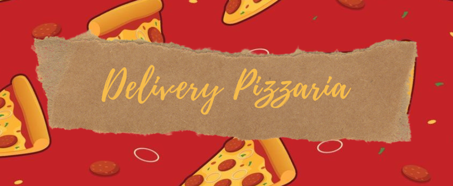

# Back-end Case Pizzaria



## 🚀 Descrição do Projeto

A intenção é criar uma API onde se pudesse fazer a solicitação das pizzas já cadastradas gerando um Ordem de pizzas. E também onde poderia requisitar todas as ordem de pizzas já feitas. 

## 📋 Funcionalidades

* Get Pizzas - Aqui e feita a requisição das pizzas 
* Post Order - Por onde é feita a ordem de serviço de pizza
* Get Orders - Imprime todas as requisições de pedidos ja feitos.

[Acesse o Postman](https://documenter.getpostman.com/view/21555368/2s8YRjqE15)

### 🔧 Getting Started / Configurações de Ambiente / Setup / Instalação

O que será necessário para executar seu projeto na máquina de outra pessoa

```
// Instalar node_modules
npm install

// Realizar a migração do banco de dados
npm run migrations

// Rodar a aplicação
npm run dev
```

## 🛠️ Tecnologias Utilizadas

Mencione as ferramentas que você usou para criar seu projeto

* [Typescript](https://www.typescriptlang.org/docs/)
* [Express](https://expressjs.com/)
* [Knex](https://knexjs.org/)
* [MySQL](https://www.mysql.com/)


## ✒️ Autores
Perfil      | Link do perfil no GITHUB
--------- | ------
[](https://github.com/joaoVictorVictoy) | [João Victor Victoy](https://github.com/joaoVictorVictoy)