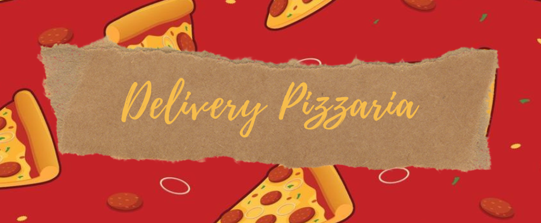

# Front-end Delivery Pizzaria


Aqui você poderá escolher a pizza que deseja e efetuar o pedido.


## 🚀 Descrição do Projeto

Nesse projeto tive o desafio de realizar a integração com a base de dados além da estilização.  

## 📋 Funcionalidades

[Link do Deploy](https://developer.mozilla.org/pt-BR/docs/Web/JavaScript)


## 🌈 Paleta de cores Utilizadas
| Preto  | Cinza  |  Amarelo | Laranja | Verde | 
| :------: | :------: |   :--------: | :--------:| :------: |
| #191919 | #969AB0  |  #FFAA2C  | #FD5C2E | #48D05F |


### 🔧 Getting Started / Configurações de Ambiente / Setup / Instalação

```
// Instale a node_modules
npm install

// Rode a aplicação 
npm run start
```

## 🛠️ Tecnologias Utilizadas

Mencione as ferramentas que você usou para criar seu projeto

* [Javascript](https://developer.mozilla.org/pt-BR/docs/Web/JavaScript)
* [React](https://pt-br.reactjs.org/docs/getting-started.html)
* [Styled-Components](https://styled-components.com/docs)
* [Axios](https://axios-http.com/ptbr/docs/intro)

## ✒️ Autores

Perfil      | Link do perfil no GITHUB
--------- | ------
[](https://github.com/joaoVictorVictoy) | [João Victoy](https://github.com/joaoVictorVictoy)